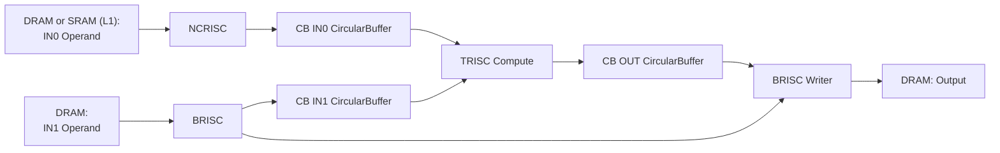

# Matmul Profiling Zones: Detailed Explanation

## Overview

This document explains the profiling zones inserted into the TT-Metal matmul kernels to break down the time measured by the `ttnn::Timer` in [`matmul.cpp`](file:///home/masterjunmo/codes/tt-metal/ttnn/cpp/ttnn/operations/matmul/matmul.cpp#L228). The profiling zones measure micro-operations within the matmul pipeline, categorized by the RISC processor executing them.

## Definitive Call Flow Trace (Proof)

You asked for the **call flow from the `ttnn.matmul` level** to prove why this specific source code (`reuse_mcast_1d_program_factory`) is used, and how `transpose` is handled.

Here is the exact execution chain found in the codebase:

### 1. The Entry Point: `ttnn.matmul`
**File**: `ttnn/cpp/ttnn/operations/matmul/matmul.cpp`
When you call `ttnn.matmul(a, b, transpose_a=True)`, the host-side function `bound_matmul` is invoked. Critical logic at line 149:

```cpp
// matmul.cpp:149
const auto& input_tensor_a_adjusted = parameters.transpose_a
                                          ? ttnn::transpose(input_tensor_a, -1, -2, ...)
                                          : input_tensor_a;
```
**Conclusion**: `ttnn` **physically performs the transpose** operation *before* passing the tensors to the matmul device operation.
*   **Implication**: The kernel factory *always* receives an operand A (IN0) that is already in the correct shape $K \times M$ (or whatever is needed). It does not need to "know" you asked for a transpose; it just sees an input tensor.
*   **IN0 is always Operand A**: Even if you transposed weights to be Operand A, they are physically passed as the first argument (`input_tensor_a_adjusted`) to the device op.

### 2. The Device Dispatcher: `create_program`
**File**: `ttnn/cpp/ttnn/operations/matmul/device/matmul_op.cpp`
The device operation calls `create_program`, which selects the strategy.
*   It calls `get_program_config` -> `get_mcast_1d_config` (Line 564).
*   It then switches on the config type in `std::visit` (Line 2790).

```cpp
// matmul_op.cpp:2720
} else if constexpr (std::is_same_v<ProgramConfigType, MatmulMultiCoreReuseMultiCast1DProgramConfig>) {
    auto mcast_mm_program = matmul_multi_core_reuse_mcast_1d_optimized(...);
    return create_homogenous_mesh_workload(mcast_mm_program, ...);
}
```

### 3. The Factory: `matmul_multi_core_reuse_mcast_1d_optimized`
**File**: `ttnn/cpp/ttnn/operations/matmul/device/matmul_op_multi_core_reuse_mcast_1d_program_factory.cpp`
This function is the definition of the factory we have been analyzing.

**Final Verdict**:
*   The **Source Code is Correct**: This factory is indeed the one executing your matmul.
*   **"In0/In1 Reversed?"**: No. Because `ttnn` physically transposed the inputs *before* calling this factory, the factory receives them as `input_tensor_a` (IN0) and `input_tensor_b` (IN1).
    *   **IN0** = The first operand passed to `matmul` (after `transpose_a` is applied).
    *   **IN1** = The second operand passed to `matmul`.
    *   If you computed `Input @ Weights^T`, then `Input` is IN0 and `Weights^T` is IN1.
    *   The "Reuse" (Multicast) applies to **IN0 (Input)**.
    *   The "Distribution" applies to **IN1 (Weights)**.

---


The TT-Metal hardware uses three types of RISC processors to execute a matmul operation in parallel:

1. **NCRISC (Network-on-Chip RISC)**: Handles **IN0** data movement from DRAM to L1 SRAM
2. **BRISC (Base RISC)**: Handles **IN1** data movement from DRAM to L1 SRAM and output writing
3. **TRISC (Tensix RISC)**: Handles the **compute** operations (matrix multiplication)

> **Note**: IN0 and IN1 can represent either weights or activations depending on how the matmul is called. For example, with `transpose_a=True`, the weight matrix may be IN0 instead of IN1. The profiling zones measure data movement regardless of which operand is which.

These processors run **concurrently**, creating a pipeline where NCRISC/BRISC feed data to TRISC.

---

## Matmul Pipeline Flow



**Key**:
- CB = Circular Buffer (L1 SRAM staging area)
- IN0 source: **DRAM** (non-sharded) or **SRAM/L1** (HEIGHT_SHARDED)
- IN1 source: **DRAM** (not sharded in this workload)

---

## Source of the Graph: Codebase Analysis

The graph above is a **logical visualization derived directly from the TT-Metal source code** that implements the matmul operation on the device. It is not an imported image but a schematic representation of the C++ implementation.

### Source Code File
The authoritative source for this pipeline architecture is:
`ttnn/cpp/ttnn/operations/matmul/device/matmul_op_multi_core_reuse_mcast_1d_program_factory.cpp`

This file serves as the **Program Factory** for the "1D Multicast with Reuse" matmul strategy, which is the **standard high-performance path** for many matmul shapes (including the one profiled).

### Terminology Explained: "Reuse" vs. "Sharding"
The file name prefix `matmul_op_multi_core_reuse_mcast...` refers to the **algorithmic strategy**, which is distinct from the **memory layout** (Sharding).

*   **"Reuse" (in the Program Factory name)**: This primarily refers to **Input Reuse via Multicast** (specifically `MCAST_IN0`).
    *   *Mechanism*: The factory `matmul_op_multi_core_reuse_mcast_1d` is designed to multicasts the **IN0 (Activations)** block to a row/column of cores. This effectively "reuses" the activation data across multiple cores that are computing different parts of the output.
    *   *Regarding Weights (IN1)*: You are completely correct that **weights are distributed**. In 1D parallelization, each core is responsible for a different slice of the weight matrix (the `N` dimension).
    *   *Correction*: The term "Reuse" here highlights that we don't need to fetch the *Activation* block for every single core from DRAM; we fetch it once and multicast it. Ideally, weights (IN1) are just read once per core (because they are unique partitions).

*   **Why IN1 (Weights) also has "Mcast" code?**:
    *   The kernel `reader_bmm_tile_layout_in1_sender_writer_padding.cpp` includes multicast logic because it supports **block-level multicast**. Even if every core has a unique *set* of weights (partitioned N), for *each specific block* operation, it might multicast that block to a small local group if the grid configuration requires it (e.g., if we map multiple cores to the same weight slice). However, conceptually, **Weights are Distributed, Activations are Reused (Multicasted).**

*   **"Sharding" (The Performance Gain)**: This refers to **L1 Residence**.
    *   *Concept*: The entire weight tensor is distributed across the cores' L1 memory **before** the op starts.
    *   *Benefit*: The "Sender" core does **zero** DRAM reads during the matrix multiplication. It simply multicasts the data already sitting in its own L1.
    *   *Correction*: My previous explanation implies that "Standard Reuse" keeps weights in L1. That was incorrect. **Standard Reuse streams through L1; Sharding stays in L1.**

### Derivation Steps
The graph was constructed by tracing the following code logic in the factory file:
1.  **Processor Assignment**: The factory creates three distinct kernels and assigns them to the three RISC processors:
    *   **NCRISC (RISCV_1)**: Assigned `reader_bmm_tile_layout_in0_sender_padding.cpp` (IN0 Reader).
    *   **BRISC (RISCV_0)**: Assigned `reader_bmm_tile_layout_in1_sender_writer_padding.cpp` (IN1 Reader/Writer).
    *   **TRISC**: Assigned `bmm_large_block_zm_fused_bias_activation.cpp` (Compute).
2.  **Data Flow**: The arrows represent the data movement commands found in these kernel files:
    *   `noc_async_read_tile` (DRAM -> L1)
    *   `cb_push_back` (L1 -> Circular Buffer)
    *   `cb_wait_front` (Circular Buffer -> Compute)

---

### Performance: Why "Reuse" with Sharding is Faster

You asked a critical question: **"If the Tenstorrent/Program Factory is 'reusing' L1 weights even without sharding, where does the performance gain from sharding come from?"**

The answer lies in **where the 'Reuse' starts**:

1.  **Without Sharding (Standard Reuse)**:
    *   **Mechanism**: The architecture "reuses" a block of weights by multicasting it to many cores.
    *   **The Cost**: Before it can reuse/multicast anything, the **Sender Core must first fetch the data from DRAM** into its L1.
    *   **Flow**: `DRAM -> Sender L1 -> Multicast -> Receiver L1s`.
    *   **Bottleneck**: That initial DRAM fetch is slow (high latency) and consumes DRAM bandwidth.

2.  **With Sharding (Sharded Reuse)**:
    *   **Mechanism**: The weights are **pre-loaded and resident in L1** before the matmul operation even begins.
    *   **The Cost**: The "fetch" step is effectively **zero cost** (or a very fast local L1 copy).
    *   **Flow**: `Sender L1 (Resident) -> Multicast -> Receiver L1s`.
    *   **Gain**: We completely eliminate the `DRAM -> Sender L1` latency and bandwidth cost.

### Is it the same source code?

*   **For IN1 (Weights)**: **Yes**, it uses the same file `reader_bmm_tile_layout_in1_sender_writer_padding.cpp`, but with a **compile-time flag** (`IN1_SHARDED = 1`). This flag tells the kernel: *"Don't read from DRAM; the data is already in your local L1."*
*   **For IN0 (Activations)**: **No**, the factory switches to a specialized kernel file: `reader_bmm_tile_layout_in0_sender_receiver_padding_block_sharded.cpp` to handle the sharded input more efficiently.

This combination of **algorithmic reuse** (multicasting) plus **memory residence** (sharding) is what delivers the maximum performance.

---

## Why BRISC Handles IN1 and NCRISC Handles IN0?

You're absolutely right to note that both BRISC and NCRISC perform identical data movement tasks (DRAM → L1 SRAM), yet they're assigned to different input operands. This design reflects **hardware-level optimizations** and **architectural roles** in TT-Metal.

### Hardware Role Definitions

**NCRISC (Network-on-Chip RISC)**:
- **Primary role**: NoC-related tasks - network data movement, routing, and synchronization
- **Secondary role**: Data producer for compute (feeds IN0 to TRISC)
- **Mapped to**: `RISCV_1` in kernel assignments

**BRISC (Base RISC)**:
- **Primary role**: Command issuer and coordinator - manages kernel execution flow
- **Secondary role**: Data producer + output writer (feeds IN1 to TRISC, writes results back)
- **Mapped to**: `RISCV_0` in kernel assignments

### Kernel Assignment in Code

From [`matmul_op_multi_core_reuse_mcast_1d_program_factory.cpp`](file:///home/masterjunmo/codes/tt-metal/ttnn/cpp/ttnn/operations/matmul/device/matmul_op_multi_core_reuse_mcast_1d_program_factory.cpp#L524-L590):

```cpp
// Line 524-535: IN0 reader kernel assigned to RISCV_1 (NCRISC)
auto mm_kernel_in0_mcast_cores_with_work_and_in_receiver_grid_id = tt_metal::CreateKernel(
    program,
    "ttnn/cpp/ttnn/operations/matmul/device/kernels/dataflow/reader_bmm_tile_layout_in0_sender_padding.cpp",
    in0_mcast_cores_with_work_and_in_receiver_grid,
    tt_metal::DataMovementConfig{
        .processor = tt_metal::DataMovementProcessor::RISCV_1,  // ← NCRISC
        .noc = in0_noc,
        .compile_args = in0_sender_compile_time_args,
        .defines = mm_kernel_in0_sender_writer_defines});

// Line 582-590: IN1 reader/writer kernel assigned to RISCV_0 (BRISC)
auto mm_kernel_in1_sender_writer_id = tt_metal::CreateKernel(
    program,
    "ttnn/cpp/ttnn/operations/matmul/device/kernels/dataflow/reader_bmm_tile_layout_in1_sender_writer_padding.cpp",
    all_cores_with_work,
    tt_metal::DataMovementConfig{
        .processor = tt_metal::DataMovementProcessor::RISCV_0,  // ← BRISC
        .noc = in1_noc,
        .compile_args = in1_sender_writer_compile_time_args,
        .defines = mm_kernel_in1_sender_writer_defines});
```

### NoC Hardware: Two Independent Network Instances on 2D Torus

TT-Metal hardware has **two physical NoC (Network-on-Chip) instances**: NOC_0 and NOC_1. From [`METALIUM_GUIDE.md`](file:///home/masterjunmo/codes/tt-metal/METALIUM_GUIDE.md#L58):

> The NoCs operate in a quasi-full-duplex configuration through a **unidirectional, wraparound topology** where **NoC 0 and NoC 1 traverse the chip in opposite directions**. This bidirectional capability allows both NoCs to simultaneously send and receive data, while the unidirectional design optimizes power consumption and silicon area utilization. The **wraparound 2D torus topology** ensures full connectivity, enabling any point on the chip to communicate with any other location. The opposing directional flow of the two NoCs naturally provides efficient return paths for data, regardless of the originating location.

**How they map to the 130-core 2D torus**:
- Both NOC_0 and NOC_1 share the **same physical 2D torus mesh**
- Each core has interfaces to **BOTH** NoC instances
- **NOC_0 and NOC_1 traverse in OPPOSITE directions** (e.g., if NOC_0 goes clockwise, NOC_1 goes counter-clockwise)
- This creates two independent routing paths through the same physical fabric
- **Key benefit**: Separating traffic onto different directional flows reduces router contention and collisions

**Critical design choice** at [Line 510-512](file:///home/masterjunmo/codes/tt-metal/ttnn/cpp/ttnn/operations/matmul/device/matmul_op_multi_core_reuse_mcast_1d_program_factory.cpp#L510-L512):

```cpp
// in1 is the reader of weights/output writer, and we choose to make it use the optimized reader noc
tt_metal::NOC in0_noc = tt::tt_metal::detail::preferred_noc_for_dram_write(device->arch());
tt_metal::NOC in1_noc = tt::tt_metal::detail::preferred_noc_for_dram_read(device->arch());
```

**What do these functions actually return?** From [`data_types.hpp`](file:///home/masterjunmo/codes/tt-metal/tt_metal/api/tt-metalium/data_types.hpp#L26-L38):

```cpp
inline NOC preferred_noc_for_dram_read(ARCH arch) {
    switch (arch) {
        case ARCH::WORMHOLE_B0:
        default: return NOC::NOC_0;  // ← Returns NOC_0
    }
}

inline NOC preferred_noc_for_dram_write(ARCH arch) {
    switch (arch) {
        case ARCH::WORMHOLE_B0:
        default: return NOC::NOC_1;  // ← Returns NOC_1
    }
}
```

**Your observation is correct**: The naming is misleading! These functions don't return "faster" or "slower" NoCs - they simply return **different physical network instances** to **separate traffic**:

- **IN0 (NCRISC)**: Uses **NOC_1** (via `preferred_noc_for_dram_write`)
- **IN1 (BRISC)**: Uses **NOC_0** (via `preferred_noc_for_dram_read`)

### Why Assign Different NoCs?

**The real reason**: **Traffic separation to avoid congestion**, NOT performance asymmetry.

**You're absolutely right** that when non-sharded:
- NCRISC: 1 DRAM read (IN0)
- BRISC: 1 DRAM read (IN1) + 1 DRAM write (output)

The compiler's choice appears to be:
1.  **Give IN1 to NOC_0** because the code comment suggests preferring this for "the reader of weights/output writer"
2.  **Give IN0 to NOC_1** to use the alternate path
3.  **Both processors also multicast** over their assigned NoCs (verified: `noc_async_write_multicast` in both kernels)

**Result**: Two independent data flows operating in parallel without interfering:
- **NOC_0 traffic**: IN1 DRAM reads + IN1 multicasts + output DRAM writes (BRISC)
- **NOC_1 traffic**: IN0 DRAM reads + IN0 multicasts (NCRISC)

**The naming confusion**: `preferred_noc_for_dram_read/write` is a naming artifact - it doesn't mean "this NoC is faster for reads/writes". It's more like "convention: use NOC_0 for read-heavy paths, NOC_1 for write-heavy paths" to maintain consistency across the codebase, but **both NoCs can handle reads, writes, and multicasts equally well**.

### Why This Specific Assignment?

**Reason 1: Workload Balance**
- BRISC: Reads IN1 + writes output (2 operations)
- NCRISC: Reads IN0 only (1 operation)
- Assigning the read-optimized NoC to BRISC balances the heavier workload

**Reason 2: Historical Architecture**
- BRISC originally acted as the "base" processor coordinating execution
- NCRISC was added later specifically for NoC-intensive operations
- Matmul leverages **both** processors for parallel data movement to maximize bandwidth

**Reason 3: Output Writing Efficiency**
- Having the same processor (BRISC) handle IN1 reads and output writes enables:
  - Better L1 cache locality
  - Simpler control flow (single kernel handles input + output)
  - Reduced inter-processor synchronization overhead

### Implications for Your Workload

In `weight_loading_test.py`:
- **IN0 = weights** (transposed, potentially HEIGHT_SHARDED)
- **IN1 = activations** (DRAM-resident)

The assignment means:
- **NCRISC** reads your sharded weights from L1 (or DRAM if not sharded)
- **BRISC** reads activations from DRAM using the optimized read NoC **and** writes results back
- **TRISC** computes the matmul while both data producers run in parallel

This explains why:
- `reader_bmm_tile_layout_in0_sender_padding.cpp` has NCRISC profiling zones for IN0
- `reader_bmm_tile_layout_in1_sender_writer_padding.cpp` has BRISC profiling zones for IN1 + output writing

---

## Profiling Zones by Source File & RISC Processor

### NCRISC Zones (IN0 Data Movement)

**Source File**: [`reader_bmm_tile_layout_in0_sender_padding.cpp`](file:///home/masterjunmo/codes/tt-metal/ttnn/cpp/ttnn/operations/matmul/device/kernels/dataflow/reader_bmm_tile_layout_in0_sender_padding.cpp)

#### 1. `READ-IN0-DRAM-TO-SRAM-PADDING`
**Lines**: [227-262](file:///home/masterjunmo/codes/tt-metal/ttnn/cpp/ttnn/operations/matmul/device/kernels/dataflow/reader_bmm_tile_layout_in0_sender_padding.cpp#L227-L262)

**Purpose**: Measures the time spent **issuing DRAM read requests** for IN0 tiles from DRAM to L1 SRAM.

**What it does**:
- Issues `noc_async_read_tile()` calls for each tile in an IN0 block
- Handles padding for the last K-dimension tile if needed
- This is the **active DRAM read bandwidth** utilization

**Relationship to Matmul**:
- This is the **first step** in the matmul pipeline
- Reads the **first input operand** (IN0) data
- One block = `in0_block_h × in0_block_w` tiles
- Repeats for `num_blocks_inner_dim` times (K-dimension blocking)

**Log Output**: `DRAM Read Issue: 0.1755 ms (Active DRAM BW)` under NCRISC

---

#### 2. `NOC-BARRIER-WAIT-IN0-PADDING`
**Lines**: [266-269](file:///home/masterjunmo/codes/tt-metal/ttnn/cpp/ttnn/operations/matmul/device/kernels/dataflow/reader_bmm_tile_layout_in0_sender_padding.cpp#L266-L269)

**Purpose**: Measures the time spent **waiting for IN0 DRAM reads to complete** via NoC barrier.

**What it does**:
- Calls `noc_async_read_barrier()` to block until all issued IN0 reads finish
- Ensures IN0 data has arrived in L1 before multicast

**Relationship to Matmul**:
- This is **DRAM read latency** for IN0 - the round-trip time to DRAM
- Includes network contention and DRAM controller queuing
- Blocks the NCRISC until IN0 data is ready for multicast

**Log Output**: `DRAM Read Latency: 3.9833 ms (Wait for Return)` under NCRISC

---

### BRISC Zones (IN1 Data Movement & Output Writing)

#### IN1 Reading Path

**Source File (Sender)**: [`reader_bmm_tile_layout_in1_sender_writer_padding.cpp`](file:///home/masterjunmo/codes/tt-metal/ttnn/cpp/ttnn/operations/matmul/device/kernels/dataflow/reader_bmm_tile_layout_in1_sender_writer_padding.cpp)

**BRISC cores are divided into**:
- **Sender cores**: Read IN1 operand from DRAM and multicast to receiver cores
- **Receiver cores**: Wait for multicast data

---

#### 3. `READ-WEIGHT-DRAM-TO-SRAM-IN1-PADDING` (Sender Only)
**Lines**: [317-342](file:///home/masterjunmo/codes/tt-metal/ttnn/cpp/ttnn/operations/matmul/device/kernels/dataflow/reader_bmm_tile_layout_in1_sender_writer_padding.cpp#L317-L342)

**Purpose**: Measures the time spent **issuing DRAM read requests** for IN1 tiles from DRAM to L1 SRAM.

**What it does**:
- Issues `noc_async_read_tile()` calls for each tile in an IN1 block
- Handles width padding for the last block if needed
- Only executes on **sender cores** (not sharded) or **when IN1_SHARDED is not defined**

**Relationship to Matmul**:
- Reads the **second input operand** (IN1) data
- One block = `in1_block_h × in1_block_w` tiles
- Repeats for `num_blocks_inner_dim` times (K-dimension blocking)

**Log Output**: `DRAM Read Issue: 0.3188 ms (Active DRAM BW)` under BRISC

> **NOTE**: With sharding enabled for IN1, this zone measures L1→CB copy time (gather operation), **not** DRAM reads, because data is pre-loaded into L1 shards. The higher value vs non-sharded is expected due to scatter/gather overhead, but overall latency is lower with sharding.

---

#### 4. `NOC-BARRIER-WAIT-IN1-PADDING` (Sender Only)
**Lines**: [346-349](file:///home/masterjunmo/codes/tt-metal/ttnn/cpp/ttnn/operations/matmul/device/kernels/dataflow/reader_bmm_tile_layout_in1_sender_writer_padding.cpp#L346-L349)

**Purpose**: Measures the time spent **waiting for IN1 DRAM reads to complete** via NoC barrier.

**What it does**:
- Calls `noc_async_read_barrier()` to block until all IN1 reads finish
- Ensures IN1 data is in L1 before multicast

**Relationship to Matmul**:
- This is **DRAM read latency** for IN1
- Sender cores must wait here before multicasting to receivers

**Log Output**: `DRAM Read Latency: 0.8092 ms (Wait for Return)` under BRISC

---

#### 5. `WEIGHT-STREAM-MCAST` (Sender Only)
**Lines**: [355-390](file:///home/masterjunmo/codes/tt-metal/ttnn/cpp/ttnn/operations/matmul/device/kernels/dataflow/reader_bmm_tile_layout_in1_sender_writer_padding.cpp#L355-L390)

**Purpose**: Measures the time spent **multicasting IN1 data** from sender cores to receiver cores via NoC.

**What it does**:
- Waits for receivers to be ready (`noc_semaphore_wait`)
- Issues `noc_async_write_multicast()` to broadcast IN1 block to all receiver cores
- Signals receivers that data is valid via semaphore multicast

**Relationship to Matmul**:
- This is the **NoC multicast bandwidth** utilization
- Critical for distributing IN1 operand across compute cores
- Enables parallel computation on multiple cores

**Log Output**: `NoC Multicast (Stream): 1.5972 ms (Active NoC BW)` under BRISC

---

#### 6. `NOC-MCAST-WAIT-PADDING` (Receiver Only)

**Source File (Receiver)**: [`reader_bmm_tile_layout_in1_receiver_writer_padding.cpp`](file:///home/masterjunmo/codes/tt-metal/ttnn/cpp/ttnn/operations/matmul/device/kernels/dataflow/reader_bmm_tile_layout_in1_receiver_writer_padding.cpp)

**Lines**: [127-130](file:///home/masterjunmo/codes/tt-metal/ttnn/cpp/ttnn/operations/matmul/device/kernels/dataflow/reader_bmm_tile_layout_in1_receiver_writer_padding.cpp#L127-L130)

**Purpose**: Measures the time **receiver cores** spend waiting for multicasted IN1 data to arrive.

**What it does**:
- Increments sender's semaphore to signal readiness
- Waits on local semaphore (`noc_semaphore_wait`) until sender multicasts IN1 data
- Blocks until sender sets semaphore to `VALID`

**Relationship to Matmul**:
- This is the **bottleneck** for receiver cores - they're idle waiting for IN1 operand
- Longest on the slowest receiver core (max latency reported)
- Includes multicast network latency + sender processing time

**Log Output**: `NOC-MCAST-WAIT-PADDING: 7.5609 ms` under BRISC (without sharding)

---

### TRISC Zones (Compute Operations)

**Source File**: [`bmm_large_block_zm_fused_bias_activation.cpp`](file:///home/masterjunmo/codes/tt-metal/ttnn/cpp/ttnn/operations/matmul/device/kernels/compute/bmm_large_block_zm_fused_bias_activation.cpp)

#### 7. `BATCH-ITERATION`
**Lines**: [151-438](file:///home/masterjunmo/codes/tt-metal/ttnn/cpp/ttnn/operations/matmul/device/kernels/compute/bmm_large_block_zm_fused_bias_activation.cpp#L151-L438)

**Purpose**: Measures the **total time for one batch iteration**, including compute and data wait stalls.

**What it does**:
- Outer loop encompassing all blocks in one batch:
  - Height blocks (`num_blocks_h_dim`)
  - Width blocks (`num_blocks_w_dim`)
  - Inner K-dimension blocks (`num_blocks_inner_dim`)
- Includes `CB-WAIT-FRONT` stalls, actual compute, and `CB-POP-FRONT`

**Relationship to Matmul**:
- This is the **critical path** for compute cores
- Includes both productive compute time and data starvation
- `Total Forward Latency` in logs = max `BATCH-ITERATION` across all TRISC cores

**Log Output**: `Total Forward Latency: 4.4608 ms` (max across TRISC_0/1/2)

---

#### 8. `CB-WAIT-FRONT`
**Lines**: [190-193](file:///home/masterjunmo/codes/tt-metal/ttnn/cpp/ttnn/operations/matmul/device/kernels/compute/bmm_large_block_zm_fused_bias_activation.cpp#L190-L193)

**Purpose**: Measures the time **compute cores spend waiting** for input data (IN0 and IN1) to arrive in circular buffers.

**What it does**:
- Calls `cb_wait_front(in0_cb_id, in0_block_num_tiles)` and `cb_wait_front(in1_cb_id, in1_block_num_tiles)`
- Blocks TRISC until NCRISC/BRISC have filled the circular buffers with enough tiles
- This is **data starvation** - compute waiting for producers

**Relationship to Matmul**:
- This is the **data wait stall** component
- High values indicate DRAM reads or NoC multicasts are the bottleneck
- TRISC_0 typically has highest wait time (first to consume data)

**Log Output**: `Data Wait Stall: 3.5618 ms (Total Wait for Data)` under TRISC_0

---

#### 9. `CB-POP-FRONT`
**Lines**: [334-337](file:///home/masterjunmo/codes/tt-metal/ttnn/cpp/ttnn/operations/matmul/device/kernels/compute/bmm_large_block_zm_fused_bias_activation.cpp#L334-L337)

**Purpose**: Measures the time spent **releasing consumed tiles** from circular buffers.

**What it does**:
- Calls `cb_pop_front(in0_cb_id, in0_block_num_tiles)` and `cb_pop_front(in1_cb_id, in1_block_num_tiles)`
- Frees circular buffer space for next block
- Minimal overhead, just bookkeeping

**Relationship to Matmul**:
- **Circular buffer management** overhead
- Negligible time (< 0.1 ms typically)
- Necessary to enable pipelining between blocks

**Log Output**: `CB-POP-FRONT: 0.0871 ms` under TRISC_0

---

#### 10. **Pure Compute Time** (Derived)

**Not directly measured** by a zone, but calculated as:

```
Pure Compute = BATCH-ITERATION - CB-WAIT-FRONT - CB-POP-FRONT
```

**What it represents**:
- Actual time spent executing `matmul_block()` operations
- Matrix multiplication arithmetic on Tensix compute cores
- The **productive work** happening on TRISC

**Relationship to Matmul**:
- This is the **theoretical minimum** matmul time if data was always available
- Determined by tensor dimensions and compute throughput
- Cannot be reduced by memory optimizations

**Log Output**: `Pure Compute: 0.8990 ms` (derived metric)

---

## Relationship to ttnn::Timer

The `ttnn::Timer` at [matmul.cpp:228](file:///home/masterjunmo/codes/tt-metal/ttnn/cpp/ttnn/operations/matmul/matmul.cpp#L228) measures the **end-to-end** matmul operation:

```cpp
ttnn::Timer timer("matmul");
// ... matmul execution ...
// Synchronize at line 268-272 ensures completion
```

The profiling zones **break down** this timer's measurement into:

### Component Breakdown Equation

```
Total Forward Latency ≈ max(TRISC BATCH-ITERATION)
                       = Pure Compute + Data Wait Stall + CB-POP-FRONT

Data Wait Stall       ≈ max(CB-WAIT-FRONT across TRISC cores)
                       ≈ max(IN1 Producer Time, IN0 Producer Time)

IN1 Producer Time     = READ-WEIGHT-DRAM-TO-SRAM-IN1-PADDING
                      + NOC-BARRIER-WAIT-IN1-PADDING
                      + WEIGHT-STREAM-MCAST
                      (for sender cores)

                      OR

                      = NOC-MCAST-WAIT-PADDING
                      (for receiver cores)

IN0 Producer Time     = READ-IN0-DRAM-TO-SRAM-PADDING
                      + NOC-BARRIER-WAIT-IN0-PADDING
```

### Key Insights

1. **Producers run in parallel**: BRISC and NCRISC execute concurrently, so total time = max(BRISC time, NCRISC time)

2. **TRISC waits for slowest producer**: `CB-WAIT-FRONT` stalls until **both** IN0 and IN1 buffers have data

3. **Receiver cores are often bottleneck**: `NOC-MCAST-WAIT-PADDING` can dominate if multicast is slow

4. **Sharding changes measurement**: With `HEIGHT_SHARDED` weights, `READ-WEIGHT-DRAM-TO-SRAM-IN1-PADDING` measures L1→CB copy, not DRAM reads

---

## Zone Insertion Rationale

### Why these specific locations?

1. **DRAM Read Issue zones** ([IN0 L227](file:///home/masterjunmo/codes/tt-metal/ttnn/cpp/ttnn/operations/matmul/device/kernels/dataflow/reader_bmm_tile_layout_in0_sender_padding.cpp#L227), [IN1 L317](file:///home/masterjunmo/codes/tt-metal/ttnn/cpp/ttnn/operations/matmul/device/kernels/dataflow/reader_bmm_tile_layout_in1_sender_writer_padding.cpp#L317)):
   - Wrapped around tight loops of `noc_async_read_tile()` calls
   - Measures **active DRAM bandwidth** time before barrier

2. **NoC Barrier Wait zones** ([IN0 L266](file:///home/masterjunmo/codes/tt-metal/ttnn/cpp/ttnn/operations/matmul/device/kernels/dataflow/reader_bmm_tile_layout_in0_sender_padding.cpp#L266), [IN1 L346](file:///home/masterjunmo/codes/tt-metal/ttnn/cpp/ttnn/operations/matmul/device/kernels/dataflow/reader_bmm_tile_layout_in1_sender_writer_padding.cpp#L346)):
   - Wrapped around `noc_async_read_barrier()` calls
   - Separates **issue time** from **latency** to identify bottlenecks

3. **Multicast zones** ([MCAST L355](file:///home/masterjunmo/codes/tt-metal/ttnn/cpp/ttnn/operations/matmul/device/kernels/dataflow/reader_bmm_tile_layout_in1_sender_writer_padding.cpp#L355), [WAIT L127](file:///home/masterjunmo/codes/tt-metal/ttnn/cpp/ttnn/operations/matmul/device/kernels/dataflow/reader_bmm_tile_layout_in1_receiver_writer_padding.cpp#L127)):
   - Sender: Measures multicast transmission time
   - Receiver: Measures wait time for data arrival
   - Critical for understanding multi-core scaling

4. **Compute zones** ([BATCH L151](file:///home/masterjunmo/codes/tt-metal/ttnn/cpp/ttnn/operations/matmul/device/kernels/compute/bmm_large_block_zm_fused_bias_activation.cpp#L151), [CB-WAIT L190](file:///home/masterjunmo/codes/tt-metal/ttnn/cpp/ttnn/operations/matmul/device/kernels/compute/bmm_large_block_zm_fused_bias_activation.cpp#L190)):
   - `BATCH-ITERATION`: Outer loop captures total compute time
   - `CB-WAIT-FRONT`: Pinpoints exact data starvation points
   - `CB-POP-FRONT`: Accounts for buffer management overhead

### Why NOT more zones?

> **IMPORTANT**: Comments in code indicate "causes buffer overflow with 130+ cores"

The profiler has a **fixed-size circular buffer** for storing zone events. With 130+ cores each logging events:
- Too many zones → buffer overflow → data loss
- Current zones chosen for **maximum insight** with **minimum events**
- Main scoped zones (e.g., `BRISC-MATMUL-READER-IN1-SENDER`) are disabled

---

## Micro-Operations in Matmul Pipeline

### Execution Timeline (Without Sharding)

```
Time →
NCRISC: [READ-IN0-DRAM]──[BARRIER-WAIT-IN0]────────────────────────────────────
BRISC:  ───────────────────[READ-IN1-DRAM]──[BARRIER-WAIT-IN1]──[MCAST]────────
TRISC:  ───────────────────────────────────────[CB-WAIT]──[COMPUTE]──[CB-POP]──
                                                            ↑
                                              Critical Path (Data Wait Stall)
```

**Key Observations**:
- NCRISC starts first, reading IN0 operand
- BRISC reads IN1 operand in parallel
- TRISC waits (`CB-WAIT`) until **both** IN0 and IN1 are ready
- **Bottleneck**: `NOC-MCAST-WAIT` on receiver cores (7.56 ms in example log)

### Execution Timeline (With Sharding Enabled for IN1)

```
Time →
NCRISC: [IDLE or reading IN0 if not sharded]────────────────────────────────────
BRISC:  [L1-TO-CB-COPY]──[BARRIER]──[MCAST]──────────────────────────────────
TRISC:  ───────────────────────────[CB-WAIT]──[COMPUTE]──[CB-POP]──────────────
                                               ↑
                                  Critical Path Reduced (2.60 ms vs 3.56 ms)
```

**Key Observations**:
- Sharded IN1 operand pre-loaded in L1 shards → no DRAM reads
- `READ-WEIGHT-DRAM-TO-SRAM-IN1-PADDING` now measures L1→CB copy (1.08 ms)
- `NOC-MCAST-WAIT` reduced to 2.47 ms (from 7.56 ms)
- Overall latency improved: **3.42 ms** (sharded) vs **4.46 ms** (non-sharded)

---

## Profiling Zone Categories

The log categorizes zones for analysis:

| Category | Zones | Purpose |
|----------|-------|---------|
| `WEIGHT_STREAM_MATMUL` | `READ-WEIGHT-DRAM-TO-SRAM-IN1-PADDING` | IN1 DRAM bandwidth |
| `ACT_STREAM_MATMUL` | `READ-IN0-DRAM-TO-SRAM-PADDING` | IN0 DRAM bandwidth |
| `NOC_WAIT_MATMUL` | `NOC-BARRIER-WAIT-IN0-PADDING`<br>`NOC-BARRIER-WAIT-IN1-PADDING`<br>`NOC-MCAST-WAIT-PADDING` | Network latencies |
| `SUBZONE_MATMUL` | `WEIGHT-STREAM-MCAST`<br>`BATCH-ITERATION`<br>`CB-POP-FRONT` | Internal operations |
| `DATA_WAIT_MATMUL` | `CB-WAIT-FRONT` | Compute stalls |

---

## Interpreting the Logs

### Without Sharding Analysis ([log](file:///home/masterjunmo/codes/tt-metal/research_codes/without_sharding_analysis.log))

**Bottleneck**: `NOC-MCAST-WAIT-PADDING` (7.56 ms) on BRISC receivers

**Why**:
- Receiver cores spend 7.56 ms waiting for multicasted weights
- **63% of total latency** wasted on waiting
- Sender must read 0.32 ms from DRAM, wait 0.81 ms barrier, then multicast 1.60 ms
- Receivers must wait for sender's full 2.73 ms + network latency

**TRISC Analysis**:
- Data Wait Stall: 3.56 ms (79% of total)
- Pure Compute: 0.90 ms (20% of total)
- **Implication**: Compute cores are starved for data

### With Sharding Analysis ([log](file:///home/masterjunmo/codes/tt-metal/research_codes/with_sharding_analysis.log))

**Improvement**: Total latency reduced to 3.42 ms (23% faster)

**Why**:
- Weights pre-loaded in L1 shards → no DRAM reads
- `READ-WEIGHT-DRAM-TO-SRAM-IN1-PADDING` = 1.08 ms (L1 copy, not DRAM)
- `NOC-MCAST-WAIT-PADDING` = 2.47 ms (67% reduction)

**TRISC Analysis**:
- Data Wait Stall: 2.60 ms (76% of total)
- Pure Compute: 0.82 ms (24% of total)
- **Implication**: Still data-bound, but less severely

**NCRISC**:
- No zones measured (activations likely also sharded or cached)

---

## Summary Table

| Zone | RISC | Source File | What It Measures | Matmul Stage |
|------|------|-------------|------------------|--------------|
| `READ-IN0-DRAM-TO-SRAM-PADDING` | NCRISC | [in0_sender](file:///home/masterjunmo/codes/tt-metal/ttnn/cpp/ttnn/operations/matmul/device/kernels/dataflow/reader_bmm_tile_layout_in0_sender_padding.cpp#L227) | IN0 DRAM read issue | IN0 operand fetch |
| `NOC-BARRIER-WAIT-IN0-PADDING` | NCRISC | [in0_sender](file:///home/masterjunmo/codes/tt-metal/ttnn/cpp/ttnn/operations/matmul/device/kernels/dataflow/reader_bmm_tile_layout_in0_sender_padding.cpp#L266) | IN0 DRAM latency | IN0 fetch (waiting) |
| `READ-WEIGHT-DRAM-TO-SRAM-IN1-PADDING` | BRISC | [in1_sender](file:///home/masterjunmo/codes/tt-metal/ttnn/cpp/ttnn/operations/matmul/device/kernels/dataflow/reader_bmm_tile_layout_in1_sender_writer_padding.cpp#L317) | IN1 DRAM read or L1 copy | IN1 operand fetch |
| `NOC-BARRIER-WAIT-IN1-PADDING` | BRISC | [in1_sender](file:///home/masterjunmo/codes/tt-metal/ttnn/cpp/ttnn/operations/matmul/device/kernels/dataflow/reader_bmm_tile_layout_in1_sender_writer_padding.cpp#L346) | IN1 DRAM latency | IN1 fetch (waiting) |
| `WEIGHT-STREAM-MCAST` | BRISC | [in1_sender](file:///home/masterjunmo/codes/tt-metal/ttnn/cpp/ttnn/operations/matmul/device/kernels/dataflow/reader_bmm_tile_layout_in1_sender_writer_padding.cpp#L355) | IN1 multicast transmission | IN1 distribution |
| `NOC-MCAST-WAIT-PADDING` | BRISC | [in1_receiver](file:///home/masterjunmo/codes/tt-metal/ttnn/cpp/ttnn/operations/matmul/device/kernels/dataflow/reader_bmm_tile_layout_in1_receiver_writer_padding.cpp#L127) | IN1 multicast wait | IN1 distribution (bottleneck) |
| `CB-WAIT-FRONT` | TRISC | [compute](file:///home/masterjunmo/codes/tt-metal/ttnn/cpp/ttnn/operations/matmul/device/kernels/compute/bmm_large_block_zm_fused_bias_activation.cpp#L190) | Data starvation stalls | Compute (waiting for data) |
| `BATCH-ITERATION` | TRISC | [compute](file:///home/masterjunmo/codes/tt-metal/ttnn/cpp/ttnn/operations/matmul/device/kernels/compute/bmm_large_block_zm_fused_bias_activation.cpp#L151) | Total batch compute time | Compute (critical path) |
| `CB-POP-FRONT` | TRISC | [compute](file:///home/masterjunmo/codes/tt-metal/ttnn/cpp/ttnn/operations/matmul/device/kernels/compute/bmm_large_block_zm_fused_bias_activation.cpp#L334) | Buffer management overhead | Compute (cleanup) |

---

## Conclusion

The profiling zones provide a **micro-operation breakdown** of the matmul pipeline:

1. **Data Movement** (NCRISC/BRISC): Zones track DRAM reads, NoC barriers, and multicasts
2. **Compute** (TRISC): Zones track data waits, actual computation, and buffer management
3. **Bottleneck Identification**: Max latency across cores pinpoints critical path

The zones enable **targeted optimization**:
- High `NOC-MCAST-WAIT`? → Use weight sharding to reduce multicast latency
- High `READ-*-DRAM`? → Increase DRAM bandwidth or use sharding/caching
- High `CB-WAIT-FRONT`? → Pipeline is data-bound, not compute-bound

All zones align with the **ttnn::Timer** measurement, providing a detailed accounting of where time is spent within the overall matmul execution measured at [`matmul.cpp:228`](file:///home/masterjunmo/codes/tt-metal/ttnn/cpp/ttnn/operations/matmul/matmul.cpp#L228).
