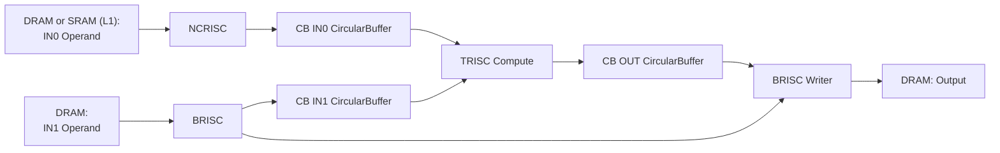

# Matmul Profiling Zones: Detailed Explanation

## Overview

This document explains the profiling zones inserted into the TT-Metal matmul kernels to break down the time measured by the `ttnn::Timer` in [`matmul.cpp`](file:///home/masterjunmo/codes/tt-metal/ttnn/cpp/ttnn/operations/matmul/matmul.cpp#L228). The profiling zones measure micro-operations within the matmul pipeline, categorized by the RISC processor executing them.

## Architecture Overview: Three RISC Processors

The TT-Metal hardware uses three types of RISC processors to execute a matmul operation in parallel:

1. **NCRISC (Network-on-Chip RISC)**: Handles **IN0** data movement from DRAM to L1 SRAM
2. **BRISC (Base RISC)**: Handles **IN1** data movement from DRAM to L1 SRAM and output writing
3. **TRISC (Tensix RISC)**: Handles the **compute** operations (matrix multiplication)

> **Note**: IN0 and IN1 can represent either weights or activations depending on how the matmul is called. For example, with `transpose_a=True`, the weight matrix may be IN0 instead of IN1. The profiling zones measure data movement regardless of which operand is which.

These processors run **concurrently**, creating a pipeline where NCRISC/BRISC feed data to TRISC.

---

## Matmul Pipeline Flow



**Key**:
- CB = Circular Buffer (L1 SRAM staging area)
- IN0 source: **DRAM** (non-sharded) or **SRAM/L1** (HEIGHT_SHARDED)
- IN1 source: **DRAM** (not sharded in this workload)

---

## Profiling Zones by Source File & RISC Processor

### NCRISC Zones (IN0 Data Movement)

**Source File**: [`reader_bmm_tile_layout_in0_sender_padding.cpp`](file:///home/masterjunmo/codes/tt-metal/ttnn/cpp/ttnn/operations/matmul/device/kernels/dataflow/reader_bmm_tile_layout_in0_sender_padding.cpp)

#### 1. `READ-IN0-DRAM-TO-SRAM-PADDING`
**Lines**: [227-262](file:///home/masterjunmo/codes/tt-metal/ttnn/cpp/ttnn/operations/matmul/device/kernels/dataflow/reader_bmm_tile_layout_in0_sender_padding.cpp#L227-L262)

**Purpose**: Measures the time spent **issuing DRAM read requests** for IN0 tiles from DRAM to L1 SRAM.

**What it does**:
- Issues `noc_async_read_tile()` calls for each tile in an IN0 block
- Handles padding for the last K-dimension tile if needed
- This is the **active DRAM read bandwidth** utilization

**Relationship to Matmul**:
- This is the **first step** in the matmul pipeline
- Reads the **first input operand** (IN0) data
- One block = `in0_block_h × in0_block_w` tiles
- Repeats for `num_blocks_inner_dim` times (K-dimension blocking)

**Log Output**: `DRAM Read Issue: 0.1755 ms (Active DRAM BW)` under NCRISC

---

#### 2. `NOC-BARRIER-WAIT-IN0-PADDING`
**Lines**: [266-269](file:///home/masterjunmo/codes/tt-metal/ttnn/cpp/ttnn/operations/matmul/device/kernels/dataflow/reader_bmm_tile_layout_in0_sender_padding.cpp#L266-L269)

**Purpose**: Measures the time spent **waiting for IN0 DRAM reads to complete** via NoC barrier.

**What it does**:
- Calls `noc_async_read_barrier()` to block until all issued IN0 reads finish
- Ensures IN0 data has arrived in L1 before multicast

**Relationship to Matmul**:
- This is **DRAM read latency** for IN0 - the round-trip time to DRAM
- Includes network contention and DRAM controller queuing
- Blocks the NCRISC until IN0 data is ready for multicast

**Log Output**: `DRAM Read Latency: 3.9833 ms (Wait for Return)` under NCRISC

---

### BRISC Zones (IN1 Data Movement & Output Writing)

#### IN1 Reading Path

**Source File (Sender)**: [`reader_bmm_tile_layout_in1_sender_writer_padding.cpp`](file:///home/masterjunmo/codes/tt-metal/ttnn/cpp/ttnn/operations/matmul/device/kernels/dataflow/reader_bmm_tile_layout_in1_sender_writer_padding.cpp)

**BRISC cores are divided into**:
- **Sender cores**: Read IN1 operand from DRAM and multicast to receiver cores
- **Receiver cores**: Wait for multicast data

---

#### 3. `READ-WEIGHT-DRAM-TO-SRAM-IN1-PADDING` (Sender Only)
**Lines**: [317-342](file:///home/masterjunmo/codes/tt-metal/ttnn/cpp/ttnn/operations/matmul/device/kernels/dataflow/reader_bmm_tile_layout_in1_sender_writer_padding.cpp#L317-L342)

**Purpose**: Measures the time spent **issuing DRAM read requests** for IN1 tiles from DRAM to L1 SRAM.

**What it does**:
- Issues `noc_async_read_tile()` calls for each tile in an IN1 block
- Handles width padding for the last block if needed
- Only executes on **sender cores** (not sharded) or **when IN1_SHARDED is not defined**

**Relationship to Matmul**:
- Reads the **second input operand** (IN1) data
- One block = `in1_block_h × in1_block_w` tiles
- Repeats for `num_blocks_inner_dim` times (K-dimension blocking)

**Log Output**: `DRAM Read Issue: 0.3188 ms (Active DRAM BW)` under BRISC

> **NOTE**: With sharding enabled for IN1, this zone measures L1→CB copy time (gather operation), **not** DRAM reads, because data is pre-loaded into L1 shards. The higher value vs non-sharded is expected due to scatter/gather overhead, but overall latency is lower with sharding.

---

#### 4. `NOC-BARRIER-WAIT-IN1-PADDING` (Sender Only)
**Lines**: [346-349](file:///home/masterjunmo/codes/tt-metal/ttnn/cpp/ttnn/operations/matmul/device/kernels/dataflow/reader_bmm_tile_layout_in1_sender_writer_padding.cpp#L346-L349)

**Purpose**: Measures the time spent **waiting for IN1 DRAM reads to complete** via NoC barrier.

**What it does**:
- Calls `noc_async_read_barrier()` to block until all IN1 reads finish
- Ensures IN1 data is in L1 before multicast

**Relationship to Matmul**:
- This is **DRAM read latency** for IN1
- Sender cores must wait here before multicasting to receivers

**Log Output**: `DRAM Read Latency: 0.8092 ms (Wait for Return)` under BRISC

---

#### 5. `WEIGHT-STREAM-MCAST` (Sender Only)
**Lines**: [355-390](file:///home/masterjunmo/codes/tt-metal/ttnn/cpp/ttnn/operations/matmul/device/kernels/dataflow/reader_bmm_tile_layout_in1_sender_writer_padding.cpp#L355-L390)

**Purpose**: Measures the time spent **multicasting IN1 data** from sender cores to receiver cores via NoC.

**What it does**:
- Waits for receivers to be ready (`noc_semaphore_wait`)
- Issues `noc_async_write_multicast()` to broadcast IN1 block to all receiver cores
- Signals receivers that data is valid via semaphore multicast

**Relationship to Matmul**:
- This is the **NoC multicast bandwidth** utilization
- Critical for distributing IN1 operand across compute cores
- Enables parallel computation on multiple cores

**Log Output**: `NoC Multicast (Stream): 1.5972 ms (Active NoC BW)` under BRISC

---

#### 6. `NOC-MCAST-WAIT-PADDING` (Receiver Only)

**Source File (Receiver)**: [`reader_bmm_tile_layout_in1_receiver_writer_padding.cpp`](file:///home/masterjunmo/codes/tt-metal/ttnn/cpp/ttnn/operations/matmul/device/kernels/dataflow/reader_bmm_tile_layout_in1_receiver_writer_padding.cpp)

**Lines**: [127-130](file:///home/masterjunmo/codes/tt-metal/ttnn/cpp/ttnn/operations/matmul/device/kernels/dataflow/reader_bmm_tile_layout_in1_receiver_writer_padding.cpp#L127-L130)

**Purpose**: Measures the time **receiver cores** spend waiting for multicasted IN1 data to arrive.

**What it does**:
- Increments sender's semaphore to signal readiness
- Waits on local semaphore (`noc_semaphore_wait`) until sender multicasts IN1 data
- Blocks until sender sets semaphore to `VALID`

**Relationship to Matmul**:
- This is the **bottleneck** for receiver cores - they're idle waiting for IN1 operand
- Longest on the slowest receiver core (max latency reported)
- Includes multicast network latency + sender processing time

**Log Output**: `NOC-MCAST-WAIT-PADDING: 7.5609 ms` under BRISC (without sharding)

---

### TRISC Zones (Compute Operations)

**Source File**: [`bmm_large_block_zm_fused_bias_activation.cpp`](file:///home/masterjunmo/codes/tt-metal/ttnn/cpp/ttnn/operations/matmul/device/kernels/compute/bmm_large_block_zm_fused_bias_activation.cpp)

#### 7. `BATCH-ITERATION`
**Lines**: [151-438](file:///home/masterjunmo/codes/tt-metal/ttnn/cpp/ttnn/operations/matmul/device/kernels/compute/bmm_large_block_zm_fused_bias_activation.cpp#L151-L438)

**Purpose**: Measures the **total time for one batch iteration**, including compute and data wait stalls.

**What it does**:
- Outer loop encompassing all blocks in one batch:
  - Height blocks (`num_blocks_h_dim`)
  - Width blocks (`num_blocks_w_dim`)
  - Inner K-dimension blocks (`num_blocks_inner_dim`)
- Includes `CB-WAIT-FRONT` stalls, actual compute, and `CB-POP-FRONT`

**Relationship to Matmul**:
- This is the **critical path** for compute cores
- Includes both productive compute time and data starvation
- `Total Forward Latency` in logs = max `BATCH-ITERATION` across all TRISC cores

**Log Output**: `Total Forward Latency: 4.4608 ms` (max across TRISC_0/1/2)

---

#### 8. `CB-WAIT-FRONT`
**Lines**: [190-193](file:///home/masterjunmo/codes/tt-metal/ttnn/cpp/ttnn/operations/matmul/device/kernels/compute/bmm_large_block_zm_fused_bias_activation.cpp#L190-L193)

**Purpose**: Measures the time **compute cores spend waiting** for input data (IN0 and IN1) to arrive in circular buffers.

**What it does**:
- Calls `cb_wait_front(in0_cb_id, in0_block_num_tiles)` and `cb_wait_front(in1_cb_id, in1_block_num_tiles)`
- Blocks TRISC until NCRISC/BRISC have filled the circular buffers with enough tiles
- This is **data starvation** - compute waiting for producers

**Relationship to Matmul**:
- This is the **data wait stall** component
- High values indicate DRAM reads or NoC multicasts are the bottleneck
- TRISC_0 typically has highest wait time (first to consume data)

**Log Output**: `Data Wait Stall: 3.5618 ms (Total Wait for Data)` under TRISC_0

---

#### 9. `CB-POP-FRONT`
**Lines**: [334-337](file:///home/masterjunmo/codes/tt-metal/ttnn/cpp/ttnn/operations/matmul/device/kernels/compute/bmm_large_block_zm_fused_bias_activation.cpp#L334-L337)

**Purpose**: Measures the time spent **releasing consumed tiles** from circular buffers.

**What it does**:
- Calls `cb_pop_front(in0_cb_id, in0_block_num_tiles)` and `cb_pop_front(in1_cb_id, in1_block_num_tiles)`
- Frees circular buffer space for next block
- Minimal overhead, just bookkeeping

**Relationship to Matmul**:
- **Circular buffer management** overhead
- Negligible time (< 0.1 ms typically)
- Necessary to enable pipelining between blocks

**Log Output**: `CB-POP-FRONT: 0.0871 ms` under TRISC_0

---

#### 10. **Pure Compute Time** (Derived)

**Not directly measured** by a zone, but calculated as:

```
Pure Compute = BATCH-ITERATION - CB-WAIT-FRONT - CB-POP-FRONT
```

**What it represents**:
- Actual time spent executing `matmul_block()` operations
- Matrix multiplication arithmetic on Tensix compute cores
- The **productive work** happening on TRISC

**Relationship to Matmul**:
- This is the **theoretical minimum** matmul time if data was always available
- Determined by tensor dimensions and compute throughput
- Cannot be reduced by memory optimizations

**Log Output**: `Pure Compute: 0.8990 ms` (derived metric)

---

## Relationship to ttnn::Timer

The `ttnn::Timer` at [matmul.cpp:228](file:///home/masterjunmo/codes/tt-metal/ttnn/cpp/ttnn/operations/matmul/matmul.cpp#L228) measures the **end-to-end** matmul operation:

```cpp
ttnn::Timer timer("matmul");
// ... matmul execution ...
// Synchronize at line 268-272 ensures completion
```

The profiling zones **break down** this timer's measurement into:

### Component Breakdown Equation

```
Total Forward Latency ≈ max(TRISC BATCH-ITERATION)
                       = Pure Compute + Data Wait Stall + CB-POP-FRONT

Data Wait Stall       ≈ max(CB-WAIT-FRONT across TRISC cores)
                       ≈ max(IN1 Producer Time, IN0 Producer Time)

IN1 Producer Time     = READ-WEIGHT-DRAM-TO-SRAM-IN1-PADDING
                      + NOC-BARRIER-WAIT-IN1-PADDING
                      + WEIGHT-STREAM-MCAST
                      (for sender cores)

                      OR

                      = NOC-MCAST-WAIT-PADDING
                      (for receiver cores)

IN0 Producer Time     = READ-IN0-DRAM-TO-SRAM-PADDING
                      + NOC-BARRIER-WAIT-IN0-PADDING
```

### Key Insights

1. **Producers run in parallel**: BRISC and NCRISC execute concurrently, so total time = max(BRISC time, NCRISC time)

2. **TRISC waits for slowest producer**: `CB-WAIT-FRONT` stalls until **both** IN0 and IN1 buffers have data

3. **Receiver cores are often bottleneck**: `NOC-MCAST-WAIT-PADDING` can dominate if multicast is slow

4. **Sharding changes measurement**: With `HEIGHT_SHARDED` weights, `READ-WEIGHT-DRAM-TO-SRAM-IN1-PADDING` measures L1→CB copy, not DRAM reads

---

## Zone Insertion Rationale

### Why these specific locations?

1. **DRAM Read Issue zones** ([IN0 L227](file:///home/masterjunmo/codes/tt-metal/ttnn/cpp/ttnn/operations/matmul/device/kernels/dataflow/reader_bmm_tile_layout_in0_sender_padding.cpp#L227), [IN1 L317](file:///home/masterjunmo/codes/tt-metal/ttnn/cpp/ttnn/operations/matmul/device/kernels/dataflow/reader_bmm_tile_layout_in1_sender_writer_padding.cpp#L317)):
   - Wrapped around tight loops of `noc_async_read_tile()` calls
   - Measures **active DRAM bandwidth** time before barrier

2. **NoC Barrier Wait zones** ([IN0 L266](file:///home/masterjunmo/codes/tt-metal/ttnn/cpp/ttnn/operations/matmul/device/kernels/dataflow/reader_bmm_tile_layout_in0_sender_padding.cpp#L266), [IN1 L346](file:///home/masterjunmo/codes/tt-metal/ttnn/cpp/ttnn/operations/matmul/device/kernels/dataflow/reader_bmm_tile_layout_in1_sender_writer_padding.cpp#L346)):
   - Wrapped around `noc_async_read_barrier()` calls
   - Separates **issue time** from **latency** to identify bottlenecks

3. **Multicast zones** ([MCAST L355](file:///home/masterjunmo/codes/tt-metal/ttnn/cpp/ttnn/operations/matmul/device/kernels/dataflow/reader_bmm_tile_layout_in1_sender_writer_padding.cpp#L355), [WAIT L127](file:///home/masterjunmo/codes/tt-metal/ttnn/cpp/ttnn/operations/matmul/device/kernels/dataflow/reader_bmm_tile_layout_in1_receiver_writer_padding.cpp#L127)):
   - Sender: Measures multicast transmission time
   - Receiver: Measures wait time for data arrival
   - Critical for understanding multi-core scaling

4. **Compute zones** ([BATCH L151](file:///home/masterjunmo/codes/tt-metal/ttnn/cpp/ttnn/operations/matmul/device/kernels/compute/bmm_large_block_zm_fused_bias_activation.cpp#L151), [CB-WAIT L190](file:///home/masterjunmo/codes/tt-metal/ttnn/cpp/ttnn/operations/matmul/device/kernels/compute/bmm_large_block_zm_fused_bias_activation.cpp#L190)):
   - `BATCH-ITERATION`: Outer loop captures total compute time
   - `CB-WAIT-FRONT`: Pinpoints exact data starvation points
   - `CB-POP-FRONT`: Accounts for buffer management overhead

### Why NOT more zones?

> **IMPORTANT**: Comments in code indicate "causes buffer overflow with 130+ cores"

The profiler has a **fixed-size circular buffer** for storing zone events. With 130+ cores each logging events:
- Too many zones → buffer overflow → data loss
- Current zones chosen for **maximum insight** with **minimum events**
- Main scoped zones (e.g., `BRISC-MATMUL-READER-IN1-SENDER`) are disabled

---

## Micro-Operations in Matmul Pipeline

### Execution Timeline (Without Sharding)

```
Time →
NCRISC: [READ-IN0-DRAM]──[BARRIER-WAIT-IN0]────────────────────────────────────
BRISC:  ───────────────────[READ-IN1-DRAM]──[BARRIER-WAIT-IN1]──[MCAST]────────
TRISC:  ───────────────────────────────────────[CB-WAIT]──[COMPUTE]──[CB-POP]──
                                                            ↑
                                              Critical Path (Data Wait Stall)
```

**Key Observations**:
- NCRISC starts first, reading IN0 operand
- BRISC reads IN1 operand in parallel
- TRISC waits (`CB-WAIT`) until **both** IN0 and IN1 are ready
- **Bottleneck**: `NOC-MCAST-WAIT` on receiver cores (7.56 ms in example log)

### Execution Timeline (With Sharding Enabled for IN1)

```
Time →
NCRISC: [IDLE or reading IN0 if not sharded]────────────────────────────────────
BRISC:  [L1-TO-CB-COPY]──[BARRIER]──[MCAST]──────────────────────────────────
TRISC:  ───────────────────────────[CB-WAIT]──[COMPUTE]──[CB-POP]──────────────
                                               ↑
                                  Critical Path Reduced (2.60 ms vs 3.56 ms)
```

**Key Observations**:
- Sharded IN1 operand pre-loaded in L1 shards → no DRAM reads
- `READ-WEIGHT-DRAM-TO-SRAM-IN1-PADDING` now measures L1→CB copy (1.08 ms)
- `NOC-MCAST-WAIT` reduced to 2.47 ms (from 7.56 ms)
- Overall latency improved: **3.42 ms** (sharded) vs **4.46 ms** (non-sharded)

---

## Profiling Zone Categories

The log categorizes zones for analysis:

| Category | Zones | Purpose |
|----------|-------|---------|
| `WEIGHT_STREAM_MATMUL` | `READ-WEIGHT-DRAM-TO-SRAM-IN1-PADDING` | IN1 DRAM bandwidth |
| `ACT_STREAM_MATMUL` | `READ-IN0-DRAM-TO-SRAM-PADDING` | IN0 DRAM bandwidth |
| `NOC_WAIT_MATMUL` | `NOC-BARRIER-WAIT-IN0-PADDING`<br>`NOC-BARRIER-WAIT-IN1-PADDING`<br>`NOC-MCAST-WAIT-PADDING` | Network latencies |
| `SUBZONE_MATMUL` | `WEIGHT-STREAM-MCAST`<br>`BATCH-ITERATION`<br>`CB-POP-FRONT` | Internal operations |
| `DATA_WAIT_MATMUL` | `CB-WAIT-FRONT` | Compute stalls |

---

## Interpreting the Logs

### Without Sharding Analysis ([log](file:///home/masterjunmo/codes/tt-metal/research_codes/without_sharding_analysis.log))

**Bottleneck**: `NOC-MCAST-WAIT-PADDING` (7.56 ms) on BRISC receivers

**Why**:
- Receiver cores spend 7.56 ms waiting for multicasted weights
- **63% of total latency** wasted on waiting
- Sender must read 0.32 ms from DRAM, wait 0.81 ms barrier, then multicast 1.60 ms
- Receivers must wait for sender's full 2.73 ms + network latency

**TRISC Analysis**:
- Data Wait Stall: 3.56 ms (79% of total)
- Pure Compute: 0.90 ms (20% of total)
- **Implication**: Compute cores are starved for data

### With Sharding Analysis ([log](file:///home/masterjunmo/codes/tt-metal/research_codes/with_sharding_analysis.log))

**Improvement**: Total latency reduced to 3.42 ms (23% faster)

**Why**:
- Weights pre-loaded in L1 shards → no DRAM reads
- `READ-WEIGHT-DRAM-TO-SRAM-IN1-PADDING` = 1.08 ms (L1 copy, not DRAM)
- `NOC-MCAST-WAIT-PADDING` = 2.47 ms (67% reduction)

**TRISC Analysis**:
- Data Wait Stall: 2.60 ms (76% of total)
- Pure Compute: 0.82 ms (24% of total)
- **Implication**: Still data-bound, but less severely

**NCRISC**:
- No zones measured (activations likely also sharded or cached)

---

## Summary Table

| Zone | RISC | Source File | What It Measures | Matmul Stage |
|------|------|-------------|------------------|--------------|
| `READ-IN0-DRAM-TO-SRAM-PADDING` | NCRISC | [in0_sender](file:///home/masterjunmo/codes/tt-metal/ttnn/cpp/ttnn/operations/matmul/device/kernels/dataflow/reader_bmm_tile_layout_in0_sender_padding.cpp#L227) | IN0 DRAM read issue | IN0 operand fetch |
| `NOC-BARRIER-WAIT-IN0-PADDING` | NCRISC | [in0_sender](file:///home/masterjunmo/codes/tt-metal/ttnn/cpp/ttnn/operations/matmul/device/kernels/dataflow/reader_bmm_tile_layout_in0_sender_padding.cpp#L266) | IN0 DRAM latency | IN0 fetch (waiting) |
| `READ-WEIGHT-DRAM-TO-SRAM-IN1-PADDING` | BRISC | [in1_sender](file:///home/masterjunmo/codes/tt-metal/ttnn/cpp/ttnn/operations/matmul/device/kernels/dataflow/reader_bmm_tile_layout_in1_sender_writer_padding.cpp#L317) | IN1 DRAM read or L1 copy | IN1 operand fetch |
| `NOC-BARRIER-WAIT-IN1-PADDING` | BRISC | [in1_sender](file:///home/masterjunmo/codes/tt-metal/ttnn/cpp/ttnn/operations/matmul/device/kernels/dataflow/reader_bmm_tile_layout_in1_sender_writer_padding.cpp#L346) | IN1 DRAM latency | IN1 fetch (waiting) |
| `WEIGHT-STREAM-MCAST` | BRISC | [in1_sender](file:///home/masterjunmo/codes/tt-metal/ttnn/cpp/ttnn/operations/matmul/device/kernels/dataflow/reader_bmm_tile_layout_in1_sender_writer_padding.cpp#L355) | IN1 multicast transmission | IN1 distribution |
| `NOC-MCAST-WAIT-PADDING` | BRISC | [in1_receiver](file:///home/masterjunmo/codes/tt-metal/ttnn/cpp/ttnn/operations/matmul/device/kernels/dataflow/reader_bmm_tile_layout_in1_receiver_writer_padding.cpp#L127) | IN1 multicast wait | IN1 distribution (bottleneck) |
| `CB-WAIT-FRONT` | TRISC | [compute](file:///home/masterjunmo/codes/tt-metal/ttnn/cpp/ttnn/operations/matmul/device/kernels/compute/bmm_large_block_zm_fused_bias_activation.cpp#L190) | Data starvation stalls | Compute (waiting for data) |
| `BATCH-ITERATION` | TRISC | [compute](file:///home/masterjunmo/codes/tt-metal/ttnn/cpp/ttnn/operations/matmul/device/kernels/compute/bmm_large_block_zm_fused_bias_activation.cpp#L151) | Total batch compute time | Compute (critical path) |
| `CB-POP-FRONT` | TRISC | [compute](file:///home/masterjunmo/codes/tt-metal/ttnn/cpp/ttnn/operations/matmul/device/kernels/compute/bmm_large_block_zm_fused_bias_activation.cpp#L334) | Buffer management overhead | Compute (cleanup) |

---

## Conclusion

The profiling zones provide a **micro-operation breakdown** of the matmul pipeline:

1. **Data Movement** (NCRISC/BRISC): Zones track DRAM reads, NoC barriers, and multicasts
2. **Compute** (TRISC): Zones track data waits, actual computation, and buffer management
3. **Bottleneck Identification**: Max latency across cores pinpoints critical path

The zones enable **targeted optimization**:
- High `NOC-MCAST-WAIT`? → Use weight sharding to reduce multicast latency
- High `READ-*-DRAM`? → Increase DRAM bandwidth or use sharding/caching
- High `CB-WAIT-FRONT`? → Pipeline is data-bound, not compute-bound

All zones align with the **ttnn::Timer** measurement, providing a detailed accounting of where time is spent within the overall matmul execution measured at [`matmul.cpp:228`](file:///home/masterjunmo/codes/tt-metal/ttnn/cpp/ttnn/operations/matmul/matmul.cpp#L228).
